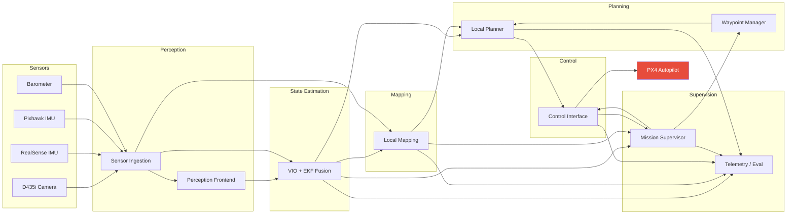
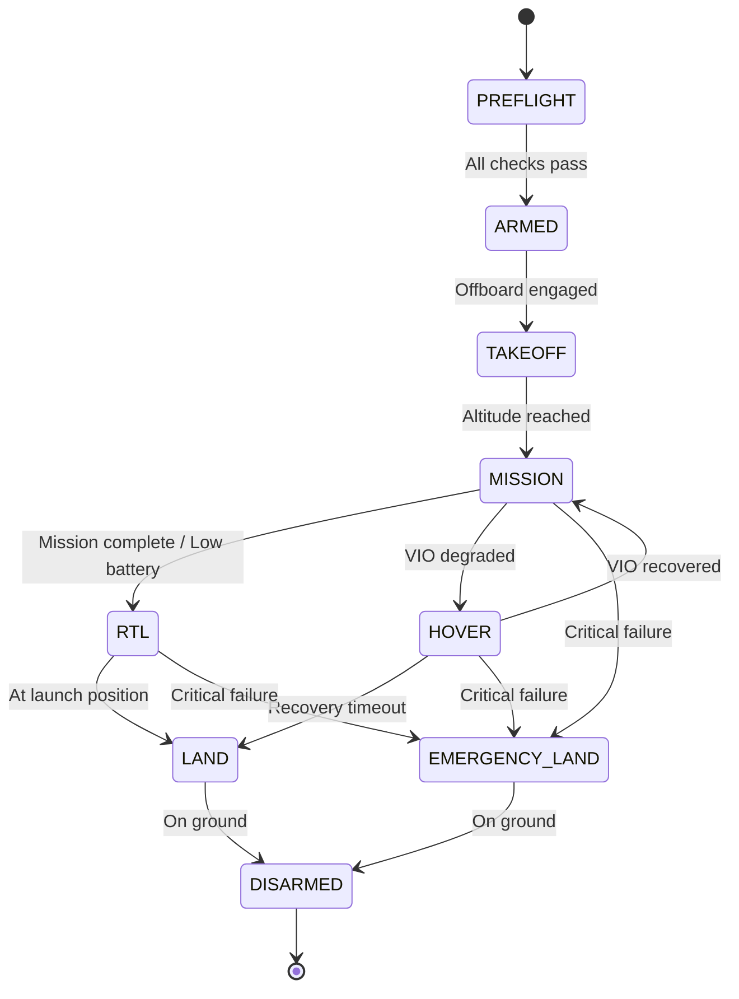

# MVP Architecture — Subsystem Specifications

> **Version**: 1.0  
> **Date**: 2026-03-09  
> **Status**: DRAFT  

---

## System Overview



---

## Subsystem 1: Sensor Ingestion

| Field | Detail |
|-------|--------|
| **Purpose** | Abstract raw sensor hardware into clean, timestamped, quality-checked ROS2 data streams. Isolate all hardware-specific drivers so downstream nodes never touch raw drivers. |
| **Inputs** | RealSense D435i USB stream (RGB + stereo IR + depth + IMU), Pixhawk IMU over MAVROS2, Pixhawk barometer |
| **Outputs** | `sensor_msgs/Image` (RGB, stereo, depth), `sensor_msgs/Imu` (hardware-synced), `sensor_msgs/FluidPressure`, `diagnostic_msgs/DiagnosticArray` |
| **Responsibilities** | Driver lifecycle management, hardware time-sync to ROS clock, image rectification + undistortion, IMU bias initialization, sensor health monitoring, graceful degradation on sensor dropout |
| **Key Algorithms/Tools** | `realsense2_camera` ROS2 wrapper, `rs2::pipeline` API, PX4-ROS2 bridge (`px4_msgs`), time synchronization via `message_filters::TimeSynchronizer` |
| **Dependencies** | `librealsense2`, `px4_msgs`, `mavros2`, `image_transport`, `cv_bridge` |
| **Failure Modes** | USB disconnect → publish diagnostic ERROR, zero-fill last frame for 500ms then halt topic. IMU timeout → publish WARNING, downstream switches to Pixhawk-only IMU. Depth saturation → publish NaN mask. |

### ROS2 Package: `gps_denied_perception`

| Node | Topics Published | Topics Subscribed | Rate |
|------|-----------------|-------------------|------|
| `camera_driver` | `/sensors/camera/color/image_raw`, `/sensors/camera/depth/image_raw`, `/sensors/camera/infra1/image_raw`, `/sensors/camera/infra2/image_raw`, `/sensors/camera/imu` | — | 30 Hz (images), 200 Hz (IMU) |
| `imu_relay` | `/sensors/imu/pixhawk` | `/fmu/out/vehicle_imu_data` | 200 Hz |
| `sensor_health_monitor` | `/sensors/diagnostics` | All `/sensors/*` topics | 1 Hz |

---

## Subsystem 2: Perception Frontend

| Field | Detail |
|-------|--------|
| **Purpose** | Extract meaningful visual features, compute optical flow, generate disparity/depth maps, and detect obstacles from raw sensor streams. Provide the "eyes" for state estimation and mapping. |
| **Inputs** | Rectified stereo images, depth images, camera intrinsics/extrinsics (from calibration) |
| **Outputs** | `gps_denied_interfaces/FeatureArray` (tracked keypoints + descriptors), `sensor_msgs/PointCloud2` (filtered 3D point cloud), `/perception/obstacle_detections` |
| **Responsibilities** | Feature extraction (ORB/FAST/SuperPoint), feature tracking across frames, stereo matching + disparity, depth image to point cloud projection, point cloud filtering (voxel downsampling, statistical outlier removal), near-field obstacle detection from depth |
| **Key Algorithms/Tools** | ORB feature detector (OpenCV), Lucas-Kanade optical flow, stereo SGBM disparity, PCL voxel grid filter, depth-based obstacle segmentation. Future: SuperPoint/SuperGlue learned features |
| **Dependencies** | OpenCV 4.x, PCL 1.12+, `cv_bridge`, `image_transport`, `gps_denied_interfaces` |
| **Failure Modes** | Feature count < 30 → publish LOW_FEATURES warning (state estimation degrades). Disparity failure (textureless) → fallback to depth-only from D435i active IR. Point cloud empty → mapping pauses, planner uses last known map. |

### ROS2 Package: `gps_denied_perception`

| Node | Topics Published | Topics Subscribed | Rate |
|------|-----------------|-------------------|------|
| `feature_extractor` | `/perception/features`, `/perception/optical_flow` | `/sensors/camera/color/image_raw`, `/sensors/camera/infra1/image_raw`, `/sensors/camera/infra2/image_raw` | 30 Hz |
| `depth_processor` | `/perception/pointcloud_filtered`, `/perception/depth_filtered` | `/sensors/camera/depth/image_raw` | 15 Hz |
| `obstacle_detector` | `/perception/obstacle_detections` | `/perception/depth_filtered` | 10 Hz |

---

## Subsystem 3: State Estimation

| Field | Detail |
|-------|--------|
| **Purpose** | Fuse visual and inertial measurements to produce a robust, low-latency, drift-bounded 6-DoF pose estimate in a local (odom) frame. This is the most critical subsystem — everything downstream depends on its accuracy. |
| **Inputs** | Tracked features from perception frontend, IMU data (both RealSense + Pixhawk), barometric altitude, (optional) loop closure detections from mapping |
| **Outputs** | `nav_msgs/Odometry` on `/state_estimation/odom` (pose + twist + covariance), `geometry_msgs/PoseStamped` on `/state_estimation/pose`, TF transform `odom → base_link`, `/state_estimation/confidence` (scalar 0–1) |
| **Responsibilities** | Visual-Inertial Odometry (VIO) — tightly-coupled visual + IMU fusion. IMU pre-integration between keyframes. Sliding-window optimization or filtering. Covariance propagation for downstream confidence. Gravity alignment and scale recovery. Relocalization after tracking loss. Feed pose to PX4 EKF2 as external vision input. |
| **Key Algorithms/Tools** | Primary: **VINS-Fusion** (stereo + IMU, tightly-coupled, proven). Alternative: ORB-SLAM3 (with IMU mode). EKF2 in PX4 fuses VIO as `vehicle_visual_odometry`. Ceres Solver for backend optimization. |
| **Dependencies** | `vins_fusion` (or `orb_slam3_ros2`), `tf2_ros`, `robot_localization` (optional secondary EKF), `px4_msgs`, Eigen3, Ceres Solver |
| **Failure Modes** | VIO tracking lost (< 15 features, motion blur) → covariance spikes → confidence drops below threshold → safety subsystem triggers HOVER. IMU bias divergence → VIO reinitialize. Scale drift → loop closure correction from mapping. |

### ROS2 Package: `gps_denied_state_estimation`

| Node | Topics Published | Topics Subscribed | Rate |
|------|-----------------|-------------------|------|
| `vio_node` | `/state_estimation/odom`, `/state_estimation/pose`, `/state_estimation/confidence` | `/sensors/camera/infra1/image_raw`, `/sensors/camera/infra2/image_raw`, `/sensors/camera/imu` | 30 Hz (pose), 200 Hz (IMU prediction) |
| `px4_vision_bridge` | — | `/state_estimation/odom` | Publishes to `/fmu/in/vehicle_visual_odometry` at 30 Hz |

### Critical Configuration Parameters

```yaml
state_estimation:
  vio_algorithm: "vins_fusion"  # or "orb_slam3"
  feature_threshold: 30         # min features for valid tracking
  confidence_threshold: 0.3     # below this → DEGRADED mode
  imu_rate: 200                 # Hz
  keyframe_interval: 0.5        # seconds
  max_covariance_position: 1.0  # m² — beyond this, tracking is "lost"
  relocalization_timeout: 5.0   # seconds to attempt before landing
```

---

## Subsystem 4: Local Mapping

| Field | Detail |
|-------|--------|
| **Purpose** | Build and maintain a local 3D occupancy representation of the environment for obstacle avoidance. Not full SLAM — focused on a rolling local map around the drone sufficient for safe navigation. |
| **Inputs** | Filtered point cloud from perception, current pose from state estimation, (optional) loop closure triggers |
| **Outputs** | `octomap_msgs/Octomap` on `/mapping/octomap`, `visualization_msgs/MarkerArray` on `/mapping/obstacles_vis`, `nav_msgs/OccupancyGrid` (2.5D projection) on `/mapping/occupancy_grid` |
| **Responsibilities** | Incremental OctoMap insertion from point clouds. Rolling window — discard voxels beyond 10m from drone. Free/occupied/unknown space classification. Obstacle inflation for safety margins. Publish both 3D (OctoMap) and 2.5D (occupancy grid) representations. Map persistence for revisited areas (if loop closure available). |
| **Key Algorithms/Tools** | **OctoMap** (probabilistic 3D occupancy, log-odds update). Voxel resolution: 0.1m (local), 0.25m (extended). PCL for cloud preprocessing. `octomap_server2` ROS2 package as starting point. |
| **Dependencies** | `octomap`, `octomap_msgs`, `pcl_ros`, `tf2_ros`, `gps_denied_state_estimation` |
| **Failure Modes** | Pose drift → map inconsistency → clear and rebuild local map. No point cloud → freeze map, mark as stale (planner uses with caution). Memory overflow → aggressive pruning of old voxels. |

### ROS2 Package: `gps_denied_mapping`

| Node | Topics Published | Topics Subscribed | Rate |
|------|-----------------|-------------------|------|
| `octomap_builder` | `/mapping/octomap`, `/mapping/occupancy_grid`, `/mapping/obstacles_vis` | `/perception/pointcloud_filtered`, `/state_estimation/pose` | 5 Hz (map update) |
| `map_manager` | `/mapping/map_status` | `/mapping/octomap`, `/state_estimation/confidence` | 1 Hz |

### Configuration

```yaml
mapping:
  resolution: 0.10              # meters per voxel
  local_map_radius: 8.0         # meters — rolling window
  insertion_max_range: 5.0      # meters — ignore depth beyond this
  obstacle_inflation: 0.3       # meters — safety margin added
  occupancy_threshold: 0.7      # probability to declare occupied
  free_threshold: 0.3           # probability to declare free
  map_stale_timeout: 5.0        # seconds — warn if no update
```

---

## Subsystem 5: Waypoint Manager

| Field | Detail |
|-------|--------|
| **Purpose** | Manage the mission-level waypoint sequence. Accept missions (YAML files or service calls), track progress, handle waypoint arrival detection, and feed the next target to the local planner. Decouple mission logic from path planning. |
| **Inputs** | Mission file (YAML) or `SetMission.srv` call, current drone pose from state estimation, waypoint arrival feedback from local planner |
| **Outputs** | `geometry_msgs/PoseStamped` on `/planning/current_goal`, `gps_denied_interfaces/WaypointList` on `/planning/remaining_waypoints`, `gps_denied_interfaces/NavigateToWaypoint.action` (feedback/result) |
| **Responsibilities** | Parse and validate mission files. Sequence waypoints in order. Detect waypoint arrival (position tolerance + optional heading tolerance). Advance to next waypoint on arrival. Handle mission pause/resume/abort commands. Re-sequence mission on operator request. Report mission progress (% complete, ETA). |
| **Key Algorithms/Tools** | Finite state machine (IDLE → ACTIVE → PAUSED → COMPLETE → ABORTED). Euclidean distance + heading check for arrival. YAML parser for mission files. ROS2 action server for `ExecuteMission`. |
| **Dependencies** | `gps_denied_interfaces`, `gps_denied_state_estimation`, `rclpy`, PyYAML |
| **Failure Modes** | Invalid mission file → reject with error, stay IDLE. Waypoint unreachable (planner fails 3x) → skip waypoint, log warning, continue to next. All waypoints unreachable → abort mission, hover. |

### ROS2 Package: `gps_denied_planning`

| Node | Topics Published | Topics Subscribed | Services | Actions |
|------|-----------------|-------------------|----------|---------|
| `waypoint_manager` | `/planning/current_goal`, `/planning/remaining_waypoints`, `/planning/mission_status` | `/state_estimation/pose` | `SetMission`, `PauseMission`, `AbortMission` | `ExecuteMission` (server) |

### Mission File Format

```yaml
# missions/warehouse_inspection.yaml
mission:
  name: "warehouse_inspection_01"
  frame_id: "odom"
  default_speed: 1.5            # m/s
  default_tolerance: 0.5        # meters
  waypoints:
    - id: 1
      x: 2.0
      y: 0.0
      z: 1.5
      yaw: 0.0                  # radians
      tolerance: 0.3
      hold_time: 2.0            # seconds to hover at waypoint
    - id: 2
      x: 5.0
      y: 3.0
      z: 1.5
      yaw: 1.57
    - id: 3
      x: 0.0
      y: 0.0
      z: 1.5
      yaw: 0.0
      label: "return_to_launch"
```

---

## Subsystem 6: Local Planner

| Field | Detail |
|-------|--------|
| **Purpose** | Compute collision-free trajectories from the current pose to the current goal waypoint, reacting to obstacles in the local map. Provide smooth, dynamically-feasible trajectories for the control interface. |
| **Inputs** | Current goal from waypoint manager, current pose + velocity from state estimation, local occupancy map from mapping |
| **Outputs** | `nav_msgs/Path` on `/planning/local_path`, `trajectory_msgs/MultiDOFJointTrajectory` on `/planning/trajectory` (timestamped, with velocities) |
| **Responsibilities** | 3D path search through occupancy grid (A* or RRT*). Path smoothing (B-spline or minimum-snap). Velocity profiling respecting dynamic limits. Reactive replanning at 5 Hz when map updates. Stuck detection (no progress for N seconds → report failure). Trajectory feasibility check (max velocity, acceleration, jerk limits). |
| **Key Algorithms/Tools** | **Primary**: RRT* (OMPL) for global path search in 3D. **Smoothing**: Minimum-snap trajectory generation (polynomial optimization). **Reactive**: DWA-3D or VFH+ for immediate obstacle avoidance. **Future**: EGO-Planner or Fast-Planner for real-time replanning. |
| **Dependencies** | OMPL, `octomap`, Eigen3, `gps_denied_mapping`, `gps_denied_state_estimation`, `gps_denied_interfaces` |
| **Failure Modes** | No collision-free path found → report to waypoint manager → try 3 times with relaxed constraints → skip waypoint. Trajectory infeasible (exceeds dynamic limits) → re-smooth with tighter constraints. Planner timeout (> 200ms) → use last valid trajectory, warn. |

### ROS2 Package: `gps_denied_planning`

| Node | Topics Published | Topics Subscribed | Rate |
|------|-----------------|-------------------|------|
| `local_planner` | `/planning/local_path`, `/planning/trajectory`, `/planning/planner_status` | `/planning/current_goal`, `/state_estimation/odom`, `/mapping/octomap` | 5 Hz (replan) |

### Configuration

```yaml
planning:
  algorithm: "rrt_star"         # rrt_star, a_star, ego_planner
  planning_horizon: 5.0         # meters ahead
  replan_rate: 5.0              # Hz
  goal_tolerance: 0.3           # meters
  max_velocity: 2.0             # m/s
  max_acceleration: 1.5         # m/s²
  max_yaw_rate: 1.0             # rad/s
  safety_margin: 0.4            # meters from obstacles
  stuck_timeout: 10.0           # seconds without progress
  max_planning_time: 0.15       # seconds per plan cycle
  smoothing: "minimum_snap"     # minimum_snap, bspline
```

---

## Subsystem 7: Control Interface

| Field | Detail |
|-------|--------|
| **Purpose** | Track planned trajectories by sending position/velocity/attitude setpoints to PX4 in offboard mode. Bridge the gap between ROS2 planning outputs and PX4 flight controller inputs. |
| **Inputs** | Timestamped trajectory from local planner, current state from state estimation, failsafe commands from safety subsystem |
| **Outputs** | PX4 offboard setpoints via `/fmu/in/trajectory_setpoint`, `/fmu/in/offboard_control_mode`, `/fmu/in/vehicle_command` |
| **Responsibilities** | Trajectory interpolation at control rate (50 Hz). Offboard mode heartbeat (must publish at ≥ 2 Hz or PX4 exits offboard). Setpoint type selection (position, velocity, or attitude). Smooth transition between trajectories on replan. Respect PX4 offboard engagement protocol (stream setpoints → request offboard → arm). Execute emergency commands (land, hover, disarm) from safety subsystem. |
| **Key Algorithms/Tools** | PX4-ROS2 bridge (`px4_ros_com`), trajectory interpolation (linear + SLERP for orientation), PX4 commander protocol for mode transitions. |
| **Dependencies** | `px4_msgs`, `px4_ros_com`, `tf2_ros`, `gps_denied_interfaces` |
| **Failure Modes** | Offboard mode rejected by PX4 → retry 3x → escalate to safety. Setpoint timeout (loop > 100ms) → PX4 auto-exits offboard → failsafe land. Trajectory discontinuity → smooth blend over 0.5s. RC override detected → yield control, log event. |

### ROS2 Package: `gps_denied_control`

| Node | Topics Published | Topics Subscribed | Rate |
|------|-----------------|-------------------|------|
| `trajectory_tracker` | `/fmu/in/trajectory_setpoint`, `/fmu/in/offboard_control_mode`, `/control/tracking_error` | `/planning/trajectory`, `/state_estimation/odom` | 50 Hz |
| `px4_commander` | `/fmu/in/vehicle_command` | `/safety/failsafe_cmd`, `/control/mode_request` | Event-driven |

### Configuration

```yaml
control:
  control_rate: 50              # Hz
  offboard_heartbeat_rate: 10   # Hz (must be > 2 Hz)
  position_tracking_kp: 1.5     # proportional gain
  velocity_ff_gain: 0.8         # feedforward
  max_tracking_error: 1.0       # meters — beyond this, replan
  trajectory_blend_time: 0.5    # seconds for smooth replan transition
  arm_timeout: 5.0              # seconds to wait for arm confirmation
```

---

## Subsystem 8: Mission Supervisor

| Field | Detail |
|-------|--------|
| **Purpose** | Top-level system health monitor and decision-maker. Orchestrate the overall mission state machine, enforce safety policies, trigger failsafe actions, and coordinate subsystem interactions. The "brain" of the autonomy stack. |
| **Inputs** | Health/status from ALL subsystems, battery state from PX4, RC input state, operator commands from GCS |
| **Outputs** | `/safety/failsafe_cmd` (land, hover, RTL, disarm), `/safety/system_status`, mode commands to waypoint manager and control interface |
| **Responsibilities** | Run top-level state machine (PREFLIGHT → ARMED → TAKEOFF → MISSION → RTL → LAND → DISARMED). Monitor all subsystem heartbeats (detect crashes). Evaluate safety conditions continuously: VIO confidence, battery, tracking error, map staleness. Trigger graduated failsafe responses (warn → hover → RTL → land → disarm). Enforce geofence boundaries. Log all state transitions for post-flight analysis. Arbitrate between autonomy and operator commands. |
| **Key Algorithms/Tools** | Hierarchical state machine (`smach` or `yasmin` for ROS2). Watchdog timers per subsystem. Decision table for failsafe escalation. |
| **Dependencies** | All other packages (subscribes to their status topics), `gps_denied_interfaces`, `px4_msgs`, `diagnostic_msgs` |
| **Failure Modes** | The supervisor itself must never crash — use exception guards around all callbacks. If supervisor detects its own anomaly → command immediate land. Watchdog: if supervisor stops publishing heartbeat, PX4 failsafe (RC Land or Auto Land) takes over. |

### ROS2 Package: `gps_denied_safety`

| Node | Topics Published | Topics Subscribed | Services |
|------|-----------------|-------------------|----------|
| `mission_supervisor` | `/safety/system_status`, `/safety/failsafe_cmd`, `/safety/state_machine` | `/state_estimation/confidence`, `/mapping/map_status`, `/control/tracking_error`, `/sensors/diagnostics`, `/fmu/out/battery_status`, `/fmu/out/vehicle_status` | `GetSystemHealth`, `EmergencyStop` |

### State Machine



### Failsafe Escalation Table

| Condition | Level | Action | Timeout to Escalate |
|-----------|-------|--------|---------------------|
| VIO confidence < 0.3 | WARNING | Reduce speed to 0.5 m/s | 3s |
| VIO confidence < 0.1 | CRITICAL | HOVER (hold position on IMU) | 5s |
| VIO lost > 5s | EMERGENCY | LAND at current position | — |
| Battery < 25% | WARNING | Abort mission, RTL | — |
| Battery < 15% | CRITICAL | Immediate LAND | — |
| Tracking error > 1.5m | WARNING | Force replan | 5s |
| Tracking error > 3.0m | CRITICAL | HOVER, request operator | 10s |
| Any node heartbeat lost | CRITICAL | HOVER | 5s |
| Supervisor heartbeat lost | — | PX4 takes over (RC Land) | — |

---

## Subsystem 9: Telemetry & Evaluation

| Field | Detail |
|-------|--------|
| **Purpose** | Record, aggregate, and publish all system metrics for real-time monitoring, post-flight analysis, and regression testing. Provide the data backbone for continuous improvement. |
| **Inputs** | All topics from all subsystems (subscriber to everything) |
| **Outputs** | `/telemetry/metrics` (aggregated), rosbag recordings, CSV exports, Grafana-compatible metrics |
| **Responsibilities** | Automated rosbag recording of all key topics. Real-time metric computation: VIO drift rate, planning success rate, tracking error RMS, CPU/GPU utilization, loop times. Publish aggregated metrics for GCS display. Post-flight report generation (HTML/PDF). Ground truth comparison in simulation (Gazebo → actual pose). Regression test data archival. |
| **Key Algorithms/Tools** | `ros2 bag` for recording. Custom metric aggregation nodes. `mcap` format for efficient storage. `plotjuggler` for visualization. Prometheus + Grafana for time-series monitoring (optional). Python analysis scripts for post-flight. |
| **Dependencies** | `rosbag2_transport`, `diagnostic_msgs`, `gps_denied_interfaces`, NumPy, Pandas, Matplotlib |
| **Failure Modes** | Disk full → stop recording, warn (never crash the flight). Metric computation lag → skip frames, publish at reduced rate. Does not affect flight safety. |

### ROS2 Package: `gps_denied_bringup` (telemetry nodes live here)

| Node | Topics Published | Topics Subscribed | Rate |
|------|-----------------|-------------------|------|
| `telemetry_aggregator` | `/telemetry/metrics`, `/telemetry/flight_summary` | ALL key topics | 1 Hz (metrics), event-driven (summary) |
| `bag_recorder` | `/telemetry/recording_status` | — (launches `ros2 bag` subprocess) | — |
| `ground_truth_comparator` | `/telemetry/gt_error` | `/state_estimation/odom`, `/sim/ground_truth/pose` | 30 Hz (sim only) |

---

## Interface Summary Matrix

| From → To | Topic | Message Type | Rate | QoS |
|-----------|-------|-------------|------|-----|
| Sensor → Perception | `/sensors/camera/color/image_raw` | `sensor_msgs/Image` | 30 Hz | Best effort |
| Sensor → Perception | `/sensors/camera/depth/image_raw` | `sensor_msgs/Image` | 30 Hz | Best effort |
| Sensor → State Est. | `/sensors/camera/imu` | `sensor_msgs/Imu` | 200 Hz | Best effort |
| Perception → State Est. | `/perception/features` | Custom `FeatureArray` | 30 Hz | Reliable |
| Perception → Mapping | `/perception/pointcloud_filtered` | `sensor_msgs/PointCloud2` | 15 Hz | Best effort |
| State Est. → Mapping | `/state_estimation/pose` | `geometry_msgs/PoseStamped` | 30 Hz | Reliable |
| State Est. → Planning | `/state_estimation/odom` | `nav_msgs/Odometry` | 30 Hz | Reliable |
| State Est. → PX4 | `/fmu/in/vehicle_visual_odometry` | `px4_msgs/VehicleOdometry` | 30 Hz | Reliable |
| Mapping → Planning | `/mapping/octomap` | `octomap_msgs/Octomap` | 5 Hz | Reliable |
| Waypoint Mgr → Planner | `/planning/current_goal` | `geometry_msgs/PoseStamped` | Event | Reliable |
| Planner → Control | `/planning/trajectory` | `trajectory_msgs/MultiDOFJointTrajectory` | 5 Hz | Reliable |
| Control → PX4 | `/fmu/in/trajectory_setpoint` | `px4_msgs/TrajectorySetpoint` | 50 Hz | Best effort |
| Supervisor → Control | `/safety/failsafe_cmd` | Custom `FailsafeCommand` | Event | Reliable |

---

## Latency Budget

| Subsystem | Max Latency | Notes |
|-----------|-------------|-------|
| Sensor ingestion | 5 ms | Driver + rectification |
| Feature extraction | 10 ms | ORB on GPU |
| VIO pose update | 15 ms | Per-frame optimization |
| Depth → point cloud | 8 ms | GPU projection |
| OctoMap insertion | 20 ms | Per cloud |
| Path planning | 150 ms | Per replan cycle |
| Trajectory tracking | 5 ms | Interpolation only |
| **Total perception→control** | **< 50 ms** | **Hard requirement** |

---

## Technology Decision Log

| Decision | Chosen | Alternatives Considered | Rationale |
|----------|--------|------------------------|-----------|
| VIO engine | VINS-Fusion | ORB-SLAM3, MSCKF, Kimera | Best stereo+IMU fusion, open-source, ROS2 ports available |
| Mapping | OctoMap | Voxblox, FIESTA, UFOMap | Simpler, proven, good ROS2 integration |
| Planning | RRT* (OMPL) + min-snap | EGO-Planner, Fast-Planner | Modular, 3D native, well-understood |
| Smoothing | Minimum-snap polynomial | B-spline, Bezier | Dynamically optimal for multirotors |
| PX4 bridge | px4_ros_com (uXRCE-DDS) | MAVROS2 | Native PX4-ROS2 bridge, lower overhead |
| State machine | yasmin | smach, BehaviorTree.CPP | ROS2 native, Python, visual debugging |
