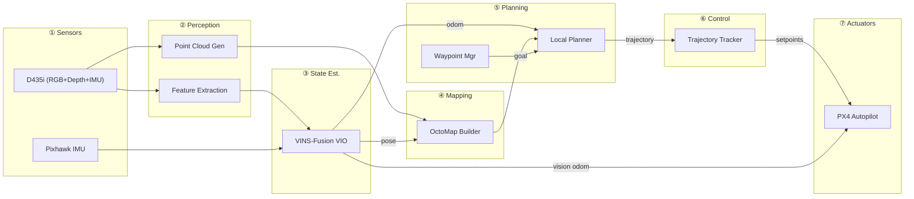

# End-to-End Subsystem Workflow — Sensor to Control

> **Version**: 1.0 | **Date**: 2026-03-09

---

## 1. Pipeline Overview



---

## 2. Frame-by-Frame Timing (30 Hz main loop, 33ms budget)

| Time | Stage | Operation |
|------|-------|-----------|
| 0.0ms | Capture | D435i frame (RGB + depth + IMU) arrives via USB3 |
| 1.0ms | Ingest | Driver publishes rectified images + synchronized IMU |
| 2.5ms | Perception | ORB feature extraction (GPU-accelerated) |
| 5.0ms | Perception | KLT feature tracking against previous frame |
| 8.0ms | Perception | Stereo matching, depth filtering, point cloud generation |
| 10.0ms | State Est. | VINS-Fusion keyframe check + sliding-window optimization |
| 15.0ms | State Est. | Pose + covariance published; TF `odom→base_link` broadcast |
| 16.0ms | State Est. | Pose forwarded to PX4 as `vehicle_visual_odometry` |
| 17.0ms | Mapping | OctoMap insertion with current point cloud + pose |
| 22.0ms | Mapping | Obstacle inflation + 2.5D grid projection |
| 25.0ms | Planning | Replan check (new map / goal change / stuck) |
| 26.0ms | Planning | RRT* search + min-snap smoothing (if triggered, up to 150ms) |
| 30.0ms | Control | Trajectory interpolation → PX4 setpoint publish |

**High-rate IMU loop (200 Hz / 5ms):** IMU pre-integration runs continuously, propagating predicted pose between visual frames. Control setpoints published at 50 Hz.

---

## 3. Interface Contracts

### 3.1 Key Topics

| From → To | Topic | Msg Type | Rate | QoS |
|-----------|-------|----------|------|-----|
| Sensor→Percep | `/sensors/camera/color/image_raw` | `sensor_msgs/Image` | 30Hz | Best-effort, depth=1 |
| Sensor→Percep | `/sensors/camera/depth/image_raw` | `sensor_msgs/Image` | 30Hz | Best-effort, depth=1 |
| Sensor→StateEst | `/sensors/camera/imu` | `sensor_msgs/Imu` | 200Hz | Best-effort, depth=5 |
| Percep→Mapping | `/perception/pointcloud_filtered` | `sensor_msgs/PointCloud2` | 15Hz | Best-effort, depth=1 |
| StateEst→All | `/state_estimation/odom` | `nav_msgs/Odometry` | 30Hz | Reliable, depth=1 |
| StateEst→Safety | `/state_estimation/confidence` | `std_msgs/Float32` | 10Hz | Reliable, depth=1 |
| StateEst→PX4 | `/fmu/in/vehicle_visual_odometry` | `px4_msgs/VehicleOdometry` | 30Hz | Reliable, depth=1 |
| Mapping→Plan | `/mapping/octomap` | `octomap_msgs/Octomap` | 5Hz | Reliable, depth=1 |
| WPMgr→Plan | `/planning/current_goal` | `geometry_msgs/PoseStamped` | Event | Reliable, depth=1 |
| Plan→Control | `/planning/trajectory` | `trajectory_msgs/MultiDOFJointTrajectory` | 5Hz | Reliable, depth=1 |
| Control→PX4 | `/fmu/in/trajectory_setpoint` | `px4_msgs/TrajectorySetpoint` | 50Hz | Best-effort, depth=1 |
| Safety→Control | `/safety/failsafe_cmd` | Custom `FailsafeCommand` | Event | Reliable, depth=5 |

### 3.2 TF Tree

```
map (if loop closure available)
 └── odom (VIO origin)
      └── base_link (drone body)
           ├── camera_link → camera_color_optical_frame
           │               → camera_depth_optical_frame
           └── imu_link
```

### 3.3 QoS Profiles

```python
SENSOR_QOS  = QoSProfile(reliability=BEST_EFFORT, depth=1)   # Tolerate drops
STATE_QOS   = QoSProfile(reliability=RELIABLE, depth=1)       # Must deliver
SAFETY_QOS  = QoSProfile(reliability=RELIABLE, durability=TRANSIENT_LOCAL, depth=5)
```

---

## 4. Latency Budget

| Subsystem | Budget | Notes |
|-----------|--------|-------|
| Sensor ingestion | 5ms | Driver + rectification |
| Feature extraction | 10ms | ORB on GPU |
| VIO pose update | 15ms | Keyframe optimization |
| Point cloud gen | 8ms | GPU projection + filtering |
| OctoMap insertion | 20ms | Per cloud update |
| Path planning | 150ms | Per replan cycle (amortized) |
| Trajectory tracking | 5ms | Interpolation only |
| **Total sensor→control** | **< 50ms** | **Hard requirement** |

---

## 5. Computational Budget (Jetson Orin Nano)

| Subsystem | CPU Cores | GPU | RAM |
|-----------|-----------|-----|-----|
| RealSense driver | 0.5 | — | 200MB |
| Perception (ORB + PCL) | 0.8 | 10% | 150MB |
| VINS-Fusion VIO | 2.0 | — | 300MB |
| OctoMap | 1.0 | — | 200MB |
| Local planner | 1.0 | — | 100MB |
| Control + PX4 bridge | 0.3 | — | 50MB |
| Supervisor + telemetry | 0.3 | — | 50MB |
| **Total** | **~5.9/6** | **~10%** | **~1050/8192MB** |

> [!WARNING]
> CPU budget is tight. Use `intra_process_comms` between co-located nodes and GPU-accelerate ORB extraction early.

---

## 6. Degradation Cascade

```
NOMINAL ────── All subsystems healthy, full speed (2 m/s)
  │
  │ Feature count < 30
  ▼
DEGRADED_PERCEPTION ── VIO running with fewer features, covariance growing
  │                     Speed reduced to 1.0 m/s, conservative planning margins
  │
  │ VIO confidence < 0.3
  ▼
DEGRADED_LOCALIZATION ── IMU-only dead-reckoning, mapping paused
  │                       Speed 0.5 m/s, planner frozen, attempting VIO re-init
  │
  │ No VIO recovery in 5s
  ▼
EMERGENCY ────── HOVER (IMU position hold) → LAND after 5s → DISARM
```

### Subsystem Dependency Matrix

| Subsystem | Degrades Without | Fails Without |
|-----------|-----------------|---------------|
| Perception | Depth sensor | Camera (mono minimum) |
| State Estimation | Loop closures, baro | IMU, Camera features |
| Mapping | Pose (freezes map) | Point cloud source |
| Planning | Map (uses last known) | Pose, Goal |
| Control | New trajectory (holds) | PX4 connection |
| Supervisor | Any one subsystem | Cannot fail (hardened) |

---

## 7. Mission Cycle Timing

```
Time →  0s       5s       10s      15s      20s      ...     Ns
Sensors ████████████████████████████████████████████████████████
VIO     ████████████████████████████████████████████████████████
Mapping   ██████████████████████████████████████████████████████
WP Mgr  ─┤WP1├────────────┤WP2├──────────┤WP3├───────────────
Planner   ░░█░░░░░█░░░░░░░░█░░░░░░█░░░░░░█░░░░░░░░░░░░░░░░░░
Control ████████████████████████████████████████████████████████
Safety  ▓▓▓▓▓▓▓▓▓▓▓▓▓▓▓▓▓▓▓▓▓▓▓▓▓▓▓▓▓▓▓▓▓▓▓▓▓▓▓▓▓▓▓▓▓▓▓▓▓▓
BagRec  ████████████████████████████████████████████████████████

█ = continuous  ░ = event-triggered  ▓ = watchdog  ├─┤ = active segment
```
